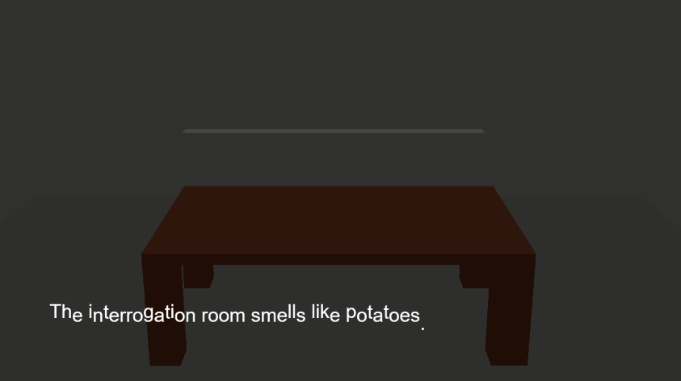

# Hash-Brown Slinging Slasher

Author: Rae

Design: A murder mystery about potatoes!

Text Drawing: 

Text is rendered at runtime.
HarfBuzz was used for text-shaping and FreeType was used to rasterize glyphs.
The resulting bitmaps were uploaded as textures and drawn to the screen using OpenGL similarly to the PPU466 in project1.

Choices: 

I tried using Inky-- I could not get the workflow with c++ to work.
Text is stored in an array, along with the respective choices.
Entering a valid choice jumps to the corresponding index to continue the story.

Screen Shot:

How To Play:

Space to move text forward.
Click 1, 2, or 3 when promoted to make a choice.

Sources: :(

This game was built with [NEST](NEST.md).

